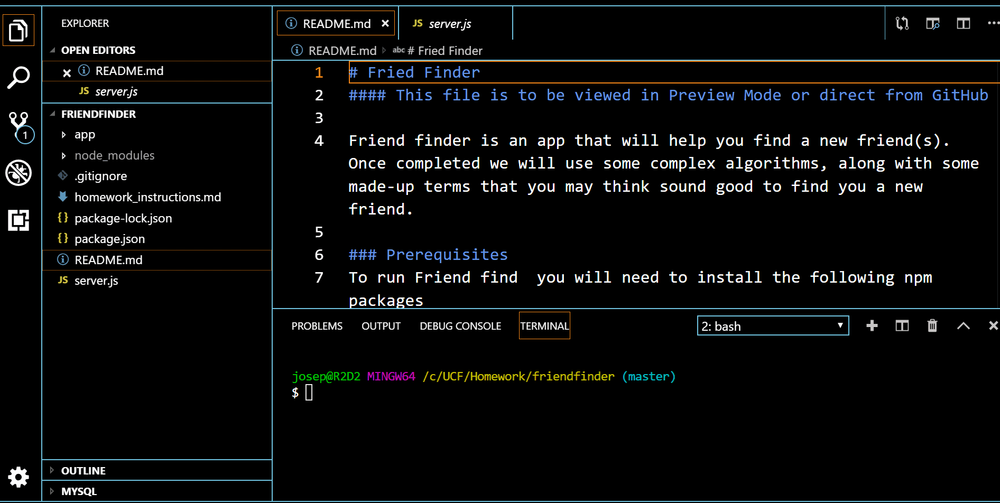

# Fried Finder
#### This file is to be viewed in Preview Mode or direct from GitHub

Friend finder is an app that will help you find a new friend(s).   Once completed we will use some complex algorithms, along with some made-up terms that you may think sound good to find you a new friend.  

### Prerequisites
To run Friend find  you will need to install the following npm packages
express
path
You will also need to give me more time to compleate the code

### Installing
The above can all be installed by typing 'npm install'

## Getting Started
please see our heroku Link
## Video of progam in use

#### Will self run in preview mode, or direct from GitHub
Please hold applause till the end!

*  - working gif

## Contributing
A file by Joseph Falconettti

## Versioning
Ver 0.5.0

## License

